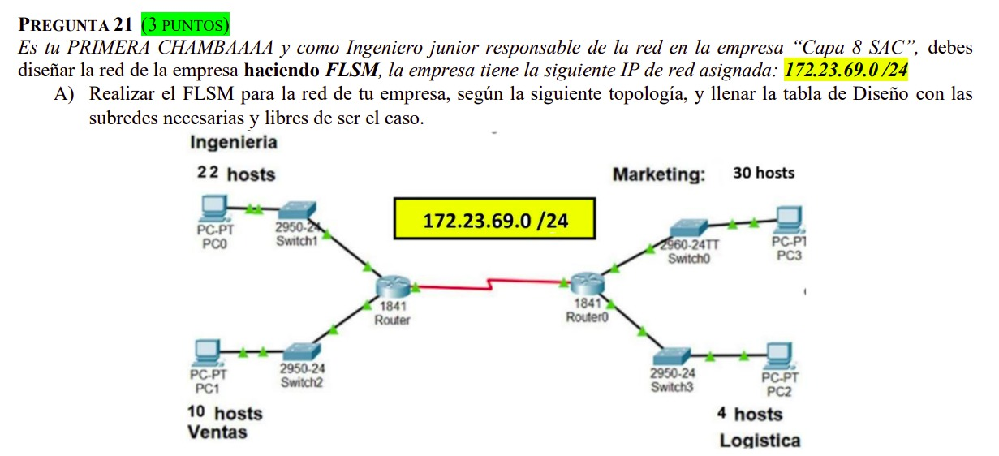

# Outbound, IPv4, Máscaras y Subneteo

Outbound da información, flujo hacia abajo, capa 1 aplicación, depende del modelo.

Segmento, paquete, trama.

## IPv4 básico

IPv4 son 32 bits.

```
1 bit  -> 0 y 1
2 bits -> 4 valores
3 bits -> 8 valores
...
12 bits -> 4096 valores
```

Dirección IP: son 4 grupos de 8 bits (32 bits), cada grupo puede ser de máx 255 (2 a la 8, -1).

## Máscara

Máscara e IP ambos de 32 bits, pero la máscara es subred. Su diferencia es que la máscara es una cadena de unos, que en algún momento en la máscara habrá un 0 y se completa los 32 con ceros.

```
1111 1111 -> 255
```

- Si hay en la máscara **255** → representa a la **red** en la IP.
- Si hay **0000** en la máscara → hay esa cantidad de **host** que lo representa.

```
255.255.255.00000000
24 bits de RED, 8 de host
```

Cantidad de 0 → cantidad de bits del host.

## AND lógico (Y lógico)

Para Y (lógico): multiplicación.

```
01 -> 0
00 -> 0
10 -> 0
11 -> 1
```

## ID de red

Une IPv4 y máscara: si en la máscara hay 0, lo vuelve 0.

- Primer valor: cuando los bits de host son 0, no le puedes dar porque no es útil.
- Si fueran todos 1, tampoco lo puedes dar porque es broadcast (no quieres comunicarte contigo mismo).

Redes útiles → 2 a la (# bits host) → 254 IP útiles para host.

IP host 0 → `0000 0000`. Puedes usar todas menos `0000 0000` y `1111 1111` (interconectas).

La primera red útil se le da a la conexión de router (interfaz del router).

### Ejemplo

```
IPV4:    192.168.255.10
MASCARA: 255.255.255.00000000 (11111111.11111111.11111111.00000000)

RED: 192.168.255.0 (es 0 porque según Y lógico se vuelve 0)
```

Toda red comparte la máscara.

```
MASCARA: 255.255.255.00000000  -> formato largo
MASCARA: /24                   -> formato corto (24 unos y 8 ceros)
```

Si tiene 11 ceros = 11 bits de host.

Siempre grupos de 4, bits de 8 (32 bits siempre).

### Ejercicio: ID de red de 10.25.140.200 /26

```
IP:      10.25.140.200 -> 200 en binario: 11001000
MASCARA: 255.255.255.11000000

ID RED (Y lógico dígito por dígito): 10.25.140.192
```

- Redes útiles: 2 a la 6, -2 → **62**
- 1ª IP útil se la da al router siendo su **default gateway**, porque el router comunica por defecto de manera externa.

| nombre | ID RED | /N | máscara | 1ª IP útil | última IP útil | IP broadcast |
|---|---|---|---|---|---|---|
| A | 10.25.140.192 | /26 | 255.255.255.192 | 10.25.140.193 | 10.25.140.254 | 10.25.140.255 |

```
ID IP + 1 = 1° RED ÚTIL
IP útiles/host = 2^(cantidad de "0") - 2
```

- **Switch** → lo comunica entre ellos en la misma red.
- 1ª IP útil es default gateway, para que el router se comunique al exterior.
- Subnetear: parte varias redes, ej. una /16 a una /24.
- Interfaz de router: dominio de broadcast. Por cada red distinta, una interfaz de router distinta.

### Ejercicio: 10.20.30.15

```
IPV4:    10.20.30.15 -> 10.20.00011110.00001111
MASCARA: 255.255.11000000.00000000

ID RED: 10.20.0.0/18

-en el 3° octeto de la red solo hay 6 bits de host, o sea de que como máximo puede tener 64(0-63) valores
-en el 4° octeto de la red hay 8 bits de host, o sea de que como máximo puede tener 256(0-255) valores
*OJO: NO HABLAMOS DE VALORES UTILES O NO, SINO DE USABLES*

primera RED útil: 10.20.0.1 -> (10.20.0.0 no se toca)
última RED útil:  10.20.(00)000000.00000000 -> 10.20.63.254 -> broadcast: .255
```

> **La red nunca se toca.**

### Ejercicio: 192.168.10.0/24 → /26

```
192.168.10. 0000 0000
192.168.10. 0100 0000
192.168.10. 1000 0000
192.168.10. 1100 0000
```

| Red | ID | /N | Máscara | 1ª útil | última útil | broadcast |
|---|---|---|---|---|---|---|
| RED1 | 192.168.10.0 | /26 | 255.255.255.192 | 192.168.10.1 | 192.168.10.62 | 192.168.10.63 |
| RED2 | 192.168.10.64 | /26 | 255.255.255.192 | 192.168.10.65 | 192.168.10.126 | 192.168.10.127 |
| RED3 | 192.168.10.128 | /26 | 255.255.255.192 | 192.168.10.129 | 192.168.10.190 | 192.168.10.191 |
| RED4 | 192.168.10.192 | /26 | 255.255.255.192 | 192.168.10.193 | 192.168.10.254 | 192.168.10.255 |

```
¿Cuántos host? 2^N - 2   = 62
¿Cuántos bits de host? N = 6
```

### Problema 2: 172.16.0.0/22, 10 bits de host

La red más grande tiene 40 host.

```
Qué valor se acerca más a esos bits (2^6 - 2) >= 40
Tengo 10 bits, quiero 6 bits
Divido con 10 - 6 = 4 bits de host (cantidad de SUBredes que se pueden permutar)
```

El problema pide las 5 primeras redes.

> La red no se toca.
> Solo permuto host.

```
172.16.000000-00.00000000
172.16.000000-00.01000000
172.16.000000-00.10000000
172.16.000000-00.11000000
172.16.000000-01.00000000
```

```
172.16.0.0
172.16.0.64
172.16.0.128
172.16.0.192
172.16.1.0
```

```
172.16.000000-01.01000000
172.16.000000-01.10000000
172.16.000000-01.11000000
172.16.000000-10.00000000
172.16.000000-10.01000000
172.16.000000-10.10000000
172.16.000000-10.11000000
172.16.000000-11.00000000
172.16.000000-11.01000000
172.16.000000-11.10000000
172.16.000000-11.11000000
```
> "-" separa red de host, "." separa por octetos.

### Ejercicio: 172.23.69.0/24

Hay 8 bits host, el host más grande es 30.

```
Tengo 8 bits, quiero 5 bits (2^5 = 32 - 2 >= 30)
Divido con 3 bits de host (hay 2^3 redes)
```

Pide 4 redes.

> La red no se toca.

```
172.23.69.00000000
172.23.69.00100000
172.23.69.01000000
172.23.69.01100000
172.23.69.10000000
172.23.69.10100000
172.23.69.11000000
172.23.69.11100000
```

**Mi desarrollo**
 
Después de hacer el cálculo de bits con **"tengo, quiero y divido"**, uso la cantidad de *"Divido con `a` bits de host"* para que se sume al `/n_inicial`, dando un `/n_final`, que es la máscara de todas las subredes creadas — porque sí, este ejercicio es pedir `/n -> /k`, sin pedirlo directamente.
 
Primero calculo el valor de *"Divido con `a` bits de host"*, para elevar `2` a ese número `a` y que nos den las subredes totales, permutando con `0` y `1` los primeros `a` bits de host, ya que pasarán a ser subredes. Luego lleno la tabla y listo — solo es cosa de que se creará un `/n_final` que debemos respetar en el problema.

---

| Área | ID Red | /N | Máscara | 1ª útil | última útil | broadcast |
|---|---|---|---|---|---|---|
| MARKETING | 172.23.69.0 | /27 | 255.255.255.224 | 172.23.69.1 | 172.23.69.30 | 172.23.69.31 |
| INGENIERIA | 172.23.69.32 | /27 | 255.255.255.224 | 172.23.69.33 | 172.23.69.62 | 172.23.69.63 |
| VENTAS | 172.23.69.64 | /27 | 255.255.255.224 | 172.23.69.65 | 172.23.69.94 | 172.23.69.95 |
| LOGISTICA | 172.23.69.96 | /27 | 255.255.255.224 | 172.23.69.97 | 172.23.69.126 | 172.23.69.127 |
| INTERFAZ | 172.23.69.128 | /27 | 255.255.255.224 | 172.23.69.129 | 172.23.69.158 | 172.23.69.159 |
| GENERICO1 | 172.23.69.160 | /27 | 255.255.255.224 | 172.23.69.161 | 172.23.69.190 | 172.23.69.191 |
| GENERICO2 | 172.23.69.192 | /27 | 255.255.255.224 | 172.23.69.193 | 172.23.69.222 | 172.23.69.223 |
| GENERICO3 | 172.23.69.224 | /27 | 255.255.255.224 | 172.23.69.225 | 172.23.69.254 | 172.23.69.255 |

---
> 💡 **Notita:** El truco rápido para el "salto" entre redes en subneteo es `256 - (último octeto de la máscara)`. Por ejemplo, con /26 (máscara .192), el salto es `256 - 192 = 64` → por eso las redes van de 64 en 64 (.0, .64, .128, .192). Te ahorra escribir todo el binario cuando ya tienes práctica.
